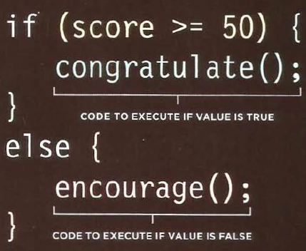
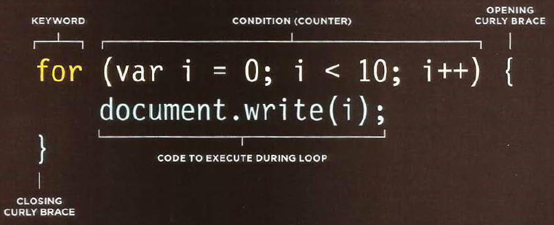

# HTML Lists, Control Flow with JS, and CSS box model  
## Lists  
There are three types of list in HTML5:
* **Ordered Lists**: 
```html
<ol>
    <li>HTML</li>
    <li>CSS</li>
    <li>JS</li>
</ol>
```  
* **Unordered Lists**:
```html
<ul>
    <li>HTML</li>
    <li>CSS</li>
    <li>JS</li>
</ul>
```  
* **Definition Lists**:
```html
<dl>
    <dt>CSS</dt>
    <dd>Used to control the presentation and style of web pages</dd>
</dl>
```  
## Boxes  
You can change the dimensions of any box in html document using the width and height attributes, they can be in pixels, percentages, or ems.  
```html
<p width=300px height=100px>
    Hello World!
</p>
```  
**Overflow content**: the overflow property tells the browser what to do if the contents within a box is larger than the box itself.
* hidden: hide any extra content that dose not fit in the box.    
* scroll: add a scroll bar so the users can scroll to see the missing content.  

Every box has three available properties that can be adjusted to control its appearance:
* **Border**: you can control many properties for border such as width, color, and style.
* **Margin**: controls the gap between boxes.
* **Padding**: represent the space between the content and the border.  

*display* property can be used to turn an inline element into a block level element or vice versa and can take four values:
* **inline**
* **block**
* **inline-block**
* **none**

## Decisions & Loops 

IF..else statements checks a condition.if it resolves to true the first code block is executed. If the condition resolves to false the second code block is run instead.  
.  
switch statement can be used to select one case among others.
```js
    switch(level) {
        case 'one':
            /// some statements
            break;
        case 'two':
            /// some statements
            break;
        default:
            /// some statements
    }
```  

### **loops**
loops used to do a block of code many times depending of the condition result. There are three types of conditions:
* **For**: used to when we know the number of iterations
  
* **While**: used to executes block of code utile the condition resolves to false.
```js
    while(x == 3) {
        /// some statements
        x++;
    }
```
* **do...while**: same as while but execute the block of code one time at least.
```js
    do {
        /// some statements
        x++;
    }while(x == 3) {
     
```