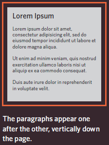
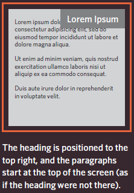

# HTML Links, JS Functions, and Intro to CSS Layout

## HTML Links
Links are regraded as the core of web, it allows the user to move from one page to another by just one click. 

**How to write links in HTML?**

links are created using anchor element `<a>`. You specify which page you want to link to using the *href* attribute.<br/><br/>
<br/><br/>

Let's talk about two important words used commonly in web which are:
* **Absolute Path** : starts with the domain name for the site such as *www.google.com*
* **Relative Path** : starts with the name of a specific page within the same site such as *index.html*  

For example, if I want to create a link to google website, follow the code below: 
```html
    <a href="https://www.google.com/">Google</a>
```
    
There is many types of links and here some of them with example for every type:
* links from one website to another.
    ```html
        <a href="https://www.apple.com/">Apple</a>
    ```
* links from one page to another on the same website.
    ```html
        <!-- link to about-us.html page in the same folder you are in-->
        <a href="about-us.html">About</a>
    ```
* links from one part of a web page to another part of the same page.
    ```html
        <!-- This will link to the element that has id = top-->
        <a href="#top">Top</a>
    ```
* links that open in a new  browser window.
    ```html
        <!-- use target attribute with value _blank to open the link in a new window-->
        <a href="https://www.samsung.com" target="_blank">Samsung</a>
    ```
* links that start up your email program.
    ```html
        <a href="mailto:zaa92reer@gmail.com">Email Me</a>
    ```

## CSS Layout

In CSS, every HTML element is treated as if it is in its own box. Based on that we have two main types of elements:
* **Block-Level Element**: starts on a new line and it's regarded the main building blocks of any layout. 
    ```html
        <!--Example for block-level elements-->
        <p> <li> <h2>
    ```
    As you can see in the following figure every block-level element stands on a new line.
    
* **Inline Elements**: flow in between surrounding text.
    ```html
        <!--Examples for inline elements-->
         <b> <em>
    ```
    Below img element as it is inline element float between text. 
      

You can control how much space each box takes up by setting the width(using width attribute) of the boxes and sometimes the height. To separate elements, you can use borders, margins, paddings and background colors.

### **Containing Elements** ###

containing element is a block-level element that surround another block-level element. it's also called parent element.Below in diagram is a containing element(`<div>` represented by orange line) for two `<p>` and two images elements.  


### **Controlling the Position of Elements(page layout)** ###

In CSS you can control the layout of your page by positioning schemes using the position property. There are three positioning schemes in css:
* **Normal Flow**: this is the default positioning scheme, where every block-level element appears on a new line.   
  
* **Relative Positioning**: Same as normal flow but the element is shifted to the top, right, bottom, or left.  

* **Absolute Positioning**: This scheme positions the element in relation to its containing element and not affecting the position of any surrounding elements.  Absolutely positioned elements move as users scroll up and down the page.  
  

To determine the exact position of an element, use the box offset properties to tell the browser how far from the top or bottom and left or right it should be placed. box offset properties are:

* **Fixed positioning**: positions the element in a fixed place in relation to the browser window and do not move when the user scroll up or down the page.  
  

* **Floating elements**: takes the element out of normal flow and position it to the right or left of a containing box. the floated element becomes a  block-level element around which other content can flow.  


##  Functions and Methods in JS  

In programming languages including javascript, function or method  is a number of instructions used to achieve specific task. it make the code more concise and reusable(rather than repeating the same set of statements) and easy to maintain in the future.
Every function must has a name that describe the task it should do. we use function's name when we need it to do that task by **calling** it. some functions need to be provided with information in order to achieve a given task. For example function to calculate the area of a box would need to know its width and height. these information known as **parameters**. some functions are expected to response by a value known as **return value**.

### **Declaring a Function**

Declaring a function is the process of create a new one by name and its instructions.
```Js
    // in this example the name is print and the instructions are document.write("Hello JavaScript!")
    function print() {
        document.write("Hello JavaScript!");
    }

    // declaration of a function with parameters
    function getArea(width, height) {
        return width * height;
    }

    // declaration od a function that return an array
    function getSize(width, height, depth) {
        var area = width * height;
        var volume = width * height* depth;
        var sizes = [area, volume];
        return sizes;
    }
```

### **Calling a Function**

After declaration , the function could be executed by calling it just in one line of code. This is known as calling the function.
```JS
    // calling print function
    print();

    // calling getArea function , the passed here values are called arguments
     var area = getArea(5, 10);

    // calling getSize function
    var area1 = getSize(4, 5, 6)[0];// return the first element in the array
    var volume = getSize(4, 5, 6)[1]// return the second element in the array
```

### **Variable Scope**

the location where you declare a variable will affect where it can be used within your code. Based on that we have more that one scop for variable:
* **Local variables**: declared within the block of the function and can not be used out of the block.
* **Global variables**: declared outside of a function and can be seen anywhere within the script.


## **6 Reasons for Pair Programming**
 > "Two heads are better than on head".

 pair programming is the practice of two developers sharing a single workstation to interactively tackle a coding task together.  

 ### **How does pair programming work?**
 In pair programming there are two roles: the driver and the navigator. the driver is responsible for writing the code and managing the text editor, files and version control. the navigator is in charge of give directions for driver and check for typos or bugs but should not be writing any code.  

 ### **Why pair programming?**  

* Greater efficiency
    * it takes less time to solve problems and bugs.
* Engaged collaboration.
    * both driver and navigator concentrate on the same point and being more focused
* learning from fellow 
    * because everyone will solve the problem in different way. 
* Improving social skills
* Job interview readiness
    * the ability to work with other is a key skill in companies
* Work environment readiness
    * many companies utilizes pair programming   


