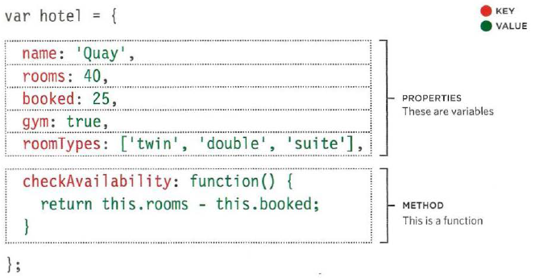
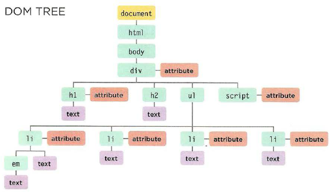

# Problem Domain, Objects , and the DOM

## Problem Domain

**What is the hardest thing about writing code?**

programmers have different points of view about this question and there are many common answers to this question:

* Learning new technology
* maintaining code
* Debugging
* Testing code

> understanding the problem domain is the hardest part of programming,  John Sonmez 

**Why problem domains  are hard?**  
because it is very difficult to solve a problem before you know the question and what is exactly required to make it possible, in this way programming will be easier.

**What can we do about it**  
There are two way to overcome problem domain:
* Make it easier by cutting off cases and narrowing your focus to a particular part of the problem.
* Get better at understanding the problem domain.

## Objects in JavaScript

creating Object in programming is a way  to model things exist in real world for example car, building and laptop. it consist from functions to simulate behaviour and variables to simulate object attributes.

For example, we can model the hotel in real world by an object. Any hotel has some attributes and operations related to. 
* properties for hotel:
    * name: string variable store the the hotel's name
    * rooms: number variable store the number of rooms in the hotel
    * booked: number variable store the number of booked rooms
    * gym : boolean variable tell if there is a gym 
    * roomTypes: array to store the types available for rooms
* methods:
    * checkAvailability: calculate the number of available rooms by subtract booked rooms from rooms variable



## Creating an object and accessing its members
In JavaScript, Object could be created by using literal notation, it's the easiest and most popular way to crate objects.  
```JS
    var hotel = {
        // properties 
        name: 'Four Seasons',
        rooms: '100',
        booked: '73',

        // methods
        checkAvailability: function() {
            return this.rooms - this.booked;
        }
    }
```

you can access the properties and methods of an object using *dot notation* and you can access properties using square brackets.  
```JS
    // Accessing property
    var hotelName = hotel.name;
    var hotelname = hotel['name'];
    // Accessing method
    var roomsFree = hotel.checkAvailability();
```

## Document Object Model (DOM)

DOM is way to create a model of an HTML page and it helps JS to update the content of a web page dynamically while it is in the browser window. it's neither part of HTML, nor part of JavaScript; it's a separate set of rules and implemented by all major browser maker and divided into main parts:
* **Making model of the HTML page**
* **Accessing and changing the HTML page** 

The DOM tree is a model of a web page. it's stored in the browser's memory and consists of four main types of nodes.
Below is a figure for DOM tree.  


DOM tree nodes:
* **The Document node**: represents the entire page and you can access other nodes using it.
* **Element node**: like h1, p tags
* **Attributes nodes**
* **Text nodes** 

## **Working with the DOM tree**
Accessing and updating th DOM tree involves two steps:
* select the node you want to work with.
* use its content, child elements,and attributes.

you can find and access elements in the DOM tree by using methods called DOM queries.
for example:
```JS  
    // this method will get back the element with one id and stores a reference to it in itemOne var
    var itemOne = getElementById('one')
``` 

DOM queries may return one element or a NodeList which is a collection of nodes. there are methods to return  a single element node :
* *getElementById('item')*: select the element with id='item
* *querySelector('li.hot')*: select one or more elements but returns only the first of the matching elements 
* *getElementByClassName('hot')*: select all elements with class = 'hot'
* *getElementByTagName('p')*: select all elements with tag is p
* *querySelectorAll('li.hot')*: select one or more elements and returns all those that match

Using DOM you can add and change the content of html tags.  
```html
    <!--store the first list item in a variable-->
    var firstItem = document.getElementById('one');
    <!--get the content of the first list item-->
    var itemContent = firstItem.innerHTML;
    <!--Update the content of the first list item so it's a link-->
    firstItem.innerHTML = '<a href="www.googel.com">content</a>' 
```

and you can add ,remove elements form the DOM.