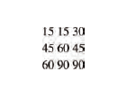

# Domain Modeling, Object-Oriented Programming and HTML Tables
## Domain Modeling
Domain modeling is the process of creating a conceptual model in code for a specific problem. A model describes the various entities, their attributes and behaviors, as well as the constraints that govern the problem domain. An entity that stores data in properties and encapsulates behaviors in methods is commonly referred to as an object-oriented model.


## HTML Tables

A table represents information in a grid format.Examples of tables include financial reports, TV schedules, and sports results.

In HTML use table element to create a new table.
```html
    <table>
        <tr>
            <td>15</td>
            <td>15</td>
            <td>30</td>
        </tr>
        <tr>
            <td>45</td>
            <td>60</td>
            <td>45</td>
        </tr>
        <tr>
            <td>60</td>
            <td>90</td>
            <td>90</td>
        </tr>     
    </table>
```   
the result shown below:  


## OOP

creating Object in programming is a way  to model things exist in real world for example car, building and laptop. it consist from functions to simulate behaviour and variables to simulate object attributes.

For example, we can model the hotel in real world by an object. Any hotel has some attributes and operations related to. 
* properties for hotel:
    * name: string variable store the the hotel's name
    * rooms: number variable store the number of rooms in the hotel
    * booked: number variable store the number of booked rooms
    * gym : boolean variable tell if there is a gym 
    * roomTypes: array to store the types available for rooms
* methods:
    * checkAvailability: calculate the number of available rooms by subtract booked rooms from rooms variable


## Creating an object and accessing its members
In JavaScript, Object could be created by using literal notation, it's the easiest and most popular way to crate objects.  
```JS
    var hotel = {
        // properties 
        name: 'Four Seasons',
        rooms: '100',
        booked: '73',

        // methods
        checkAvailability: function() {
            return this.rooms - this.booked;
        }
    }
```

you can access the properties and methods of an object using *dot notation* and you can access properties using square brackets.  
```JS
    // Accessing property
    var hotelName = hotel.name;
    var hotelname = hotel['name'];
    // Accessing method
    var roomsFree = hotel.checkAvailability();
```

The new keyword and the object constructor create a blank object.
