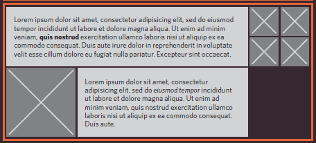
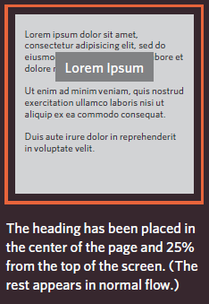

# Layout

layout is all about how to arrange elements of html documents and where every one will site.

In CSS, every HTML element is treated as if it is in its own box. Based on that we have two main types of elements:
* **Block-Level Element**: starts on a new line and it's regarded the main building blocks of any layout. 
    ```html
        <!--Example for block-level elements-->
        <p> <li> <h2>
    ```
    As you can see in the following figure every block-level element stands on a new line.
    
* **Inline Elements**: flow in between surrounding text.  
    ```html
        <!--Examples for inline elements-->
         <b> <em>
    ```  
    Below img element as it is inline element float between text.   
      

You can control how much space each box takes up by setting the width(using width attribute) of the boxes and sometimes the height. To separate elements, you can use borders, margins, paddings and background colors.

### **Containing Elements** ###

containing element is a block-level element that surround another block-level element. it's also called parent element.Below in diagram is a containing element(`<div>` represented by orange line) for two `<p>` and two images elements.  



### **Controlling the Position of Elements(page layout)** ###

In CSS you can control the layout of your page by positioning schemes using the position property. There are three positioning schemes in css:
* **Normal Flow**: this is the default positioning scheme, where every block-level element appears on a new line.   
  
* **Relative Positioning**: Same as normal flow but the element is shifted to the top, right, bottom, or left.  

* **Absolute Positioning**: This scheme positions the element in relation to its containing element and not affecting the position of any surrounding elements.  Absolutely positioned elements move as users scroll up and down the page.  
  

To determine the exact position of an element, use the box offset properties to tell the browser how far from the top or bottom and left or right it should be placed. box offset properties are:

* **Fixed positioning**: positions the element in a fixed place in relation to the browser window and do not move when the user scroll up or down the page.  
  

* **Floating elements**: takes the element out of normal flow and position it to the right or left of a containing box. the floated element becomes a  block-level element around which other content can flow.  


## layout elements (CSS Syntax)

* Normal Flow: by default all block-level elements have positioning scheme normal.  
    ```css
        p {
            position: static;
        }
    ```  
* Relative positioning: you can change to this positioning using relative value.  
    ```css
        p {
            position: relative;
            top: 10px;
            left: 80px;
        }
    ```  
* Absolute positioning: you can change to this positioning using absolute value.  
    ```css
        h1 {
            position: absolute;
            bottom: 10px;
            right: 50px;
        }
    ```   
* Fixed positioning: you can change to this positioning using absolute value.  
    ```css
        h2 {
            position: fixed;
        }
    ```  

## Screen Sizes

**Screen resolution** refers to the number of dots(or pixels) a screen shows per inch.

* **Fixed Width Layouts**: the size of content does not change as the user increase or decrease the size of their browser window.  
* **Liquid layouts**: the content of design stretch and contract as the user increase or decrease the size of their browser window.  

CSS frameworks provide rules for common tasks.