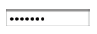
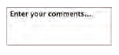

# Forms And JS Events  

Forms used in web pages to collect data from users and to make the web more dynamic, and there are several types of form controls:
* **Adding text**:
    * text input 
    * password input 
    * text area input   
* **Making choices**:
    * radio buttons: 
    * checkboxes: 
    * drop-down boxes:   
* **Submitting forms**:
    * submit buttons: 
    * image buttons: 
    * file upload: 

**How forms work?**  
1) a user fill the form and submit the info to the server
2) the name and value for each control is sent to the server
3) the server process the info sent and may store it in a database
4) the server creates a new page to send it back to the browser

you can build a form in HTML using form element:  
```html
    <form>
        <input type="text" name="xxx">
        <input type="password" name="yyy">
    </form>

    <!-- Radio buttons-->
    <form> 
        <p>select you favorite book
            <input type="radio" name="book" value="C++"> C++
            <input type="radio" name="book" value="Java"> Java
            <input type="radio" name="book" value="Python"> Python
        </p>
    </form>

    <!-- checkboxes-->
    <form>
        <p> Please select your hoppies
            <input type="checkbox" name="hoppy" value="swimming"> swimming
            <input type="checkbox" name="hoppy" value="reading"> reading
            <input type="checkbox" name="hoppy" value="walking"> walking
            <input type="checkbox" name="hoppy" value="programming"> programming
        </p>
    </form>

    <!-- Drop down list box-->
    <form>
        <p> What food do you prefer
            <select name="food">
                <option value="mansaf">mansaf</option>
                <option value="Maqlubah">maglubah</option>
                <option value="Shawerma">Shawerma</option>
            </select>
        </p>
    </form>
```  
## Lists Tables and forms  
 In html you can add many styles to list and tables, below are some of properties that can be used :

 for lists:
 * list-style-type: control the shape of a bullet point
    * none
    * disc
    * circle
    * square
* list-style-image: specify an image to act as a bullet point
* list-style-position: decide where the list should appear
    * outside
    * inside
* list-style: shorthand for list styles.  

For tables:
* width
* padding
* text-transform: to convert the content of the table headers to uppercase.
* letter-spacing, font-size to add additional styling to the content of the table headers.
* border-top, border-bottom to set borders above and below the table headers.
* text-align to align the writing to the left of some table cells and to the right of the others. 
* background-color to change the background color of the alternating table rows.

## Events in JavaScript  
While the user browsing, e/she make many different types of events:
* **UI events**:occur when a user interacts with the browser's user interface (UI) rather than the web page
    * load
    * unload
    * error
    * resize
    * scroll 
* **Keyboard events**: occur when a user interacts with the keyboard (see also input event)
    * keydown
    * keyup
    * keypress
* **Mouse events**:occur when a user interacts with a mouse. trackpad, or touchscreen
    * click
    * dbclick
    * mousedown
    * mouseup
    * mousemove
    * mouseover
    * mouseout 
* **Focus events**: occur when an element (e.g., a link or form field) gains or loses focus
    * focus
    * blur
* **Form events**: occur when a user interacts with a form element
    * input
    * change
    * submit
    * reset
    * cut
    * copy 
    * past
    * select
* **Mutation events**: occur when the DOM structure has been changed by a script  
    * DOMSubtreeModified
    * DOMNodelnserted   
    * DOMNodeRemoved
    * OOMNodelnsertedlntoDocument
    * DOMNodeRemovedFromOocument  

**How events trigger javascript code?**   
1) Select t he element node(s) you want the script to respond to. 
2) Indicate which event on the selected node(s) will trigger the response.
3) State the code you want to run when the event occurs. 

```html
    <p id="text">
        Hello World!
    </p>
    <script>
        let pElement = document.getElementById("text");
        pElement.addEventListener('click', handle);
        function handle(){
            pElement.color = 'red';
        }  
    </script>
```