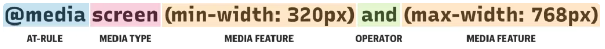

# Responsive Web Design, Floats, SMACSS
## responsive web design (RWD)  
It is the practice of developing a website that is suitable for working on different devices with different screen sizes.  
*RWD* is broken down into three main components:
* **flexible layouts**
    * capable of dynamically resizing to any width.
    * built using relative length units such as percentages and *em* units.
* **media queries**  
    * used to specify different styles for individual browser and device circumstances.
    * applied using *@media* rule inside of an existing style sheet.
    * media query anatomy: 
    * common media types include *all*, *screen*, *print*, and *braille*.
    * logical operators available for use within media query including *and*, *not*, and *only*.
    * media features identify the targeted properties or attributes. 
* **flexible media** 
    * capable of changing their size as the size of the viewport changes.   
  
## what is "Float"? 
It is a CSS positioning property used to format content e.g let am image float right to the text in a container. There are four valid values for the float property:
* *left*
* *right*
* *none*
* *inherit*

**clearing the float**  
The *clear* property specifies what elements can float beside the cleared element and on which side. It can have one of the following values:
* *left*
* *right*
* *both*
* *none*
* *inherit*

**techniques for clearing floats**
* the empty div method
* the overflow method
* the easy clearing method

## grides
The grid layout offers a grid-based layout system. with rows and columns, making it easier to design web pages. It can be applied using floats for elements that reside in a container. for example if we have two div elements inside a container the gride can be built by applying a 'float:left' for one div and 'float:right' for the other, and specify the width as a percent of the container div. Gutters in gride simply applied by add padding for the divs.  

## SMACSS  
SMACSS (Scalable and Modular Architecture for CSS) is a style guid for css that follows five simple categories:
* Base: are the default values
* Layout: divides a page into sections with elements like header, footer, main, etc.
* Module: are the reusable, modular parts od our design like navbar and sidebar.
* State: are ways to describe how our modules or layouts will look when they are into a particular state (e.g. active, inactive, expanded, hidden).
* Theme: theme rules are similar to state rules in that they describe how modules or layouts might look. It is more applicable for larger sites with shared elements that look different throughout.  

Most of the purpose of this categorization is to codify patterns __things that repeats themselves within your design. which results in less code, easier maintenance, and greater consistency in the user experience. Also, working with a team will be more easy to understood the CSS and they will not have issues with the code.
