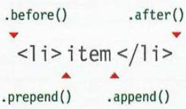

# jQuery, Events, and The DOM
## jQuery  
It is a JavaScript library offers a simpler way of doing the javascript tasks quicly and consistently, across all major browsers and without any falback code needed. jQuery finds elements using CSS-style selectors as follwing:  
  
after selecting the element, you can use jQuery methods to do something like in the following figure:  
  

**Why use JQUERY?**
Fisrt of all, any code you do in JQUERY can be done in JS, but we use jQuery because of:
* **simple selectors**
* **common tasks in less code**
* **cross-browser compatibility**  

when you select one or more elements, a jQuery object is returned. It is also known as a *matched set* or *jQuery selection*. iQuery methods can be used to get and set information for elements.
```js
    // get info
    var content = $('li').html();

    // set info
    $('li').html('Updated');
```  
when you select an element using jQuery object, it stores a reference to the corresponding elements. A jQuery object stores a references to elements. Caching a jQuery  object stores a reference to it in a variable.

* implicit iteration: the ability to update all the elements in the jQuery selection
* chaining:the processs of placing several methods in the same selector.  

You can check if the page is ready to work with using jQuery:  
```js
    $(document).ready(function() {
        // Youe script goes here
    });

    // or using the following shortcut
    $(function(){
        // Youe script goes here
    });
```

Here are four methods that update the content of all elements in a jQuery:
* .html()
* .text()
* .replaceWith()
* .remove()

inserting new elements involve:
* create new element
* insert content
    * .before()
    * .after()
    * .prepend()
    * .append()
    * 
```js
    var newItem = $('<li class="new">item</ li>');
```

getting and setting attribute values using the following methods:
* .attr()
* .removeAttr()
* .addClass()
* .removeClass()

you can get and set css properties using .css() method in jQuery.

## events
The .on () method is used to handle all events.Every event handling function receives an event object.It has methods and properties related to the event that occurred.

## Ways to Inclide jQuery in Your Page

1) include the jQuery file inside your website
2)  use a CDN

## Why Pair Programming?

* Greater efficiency
* Engaged collaboration
* Learning from fellow students
* Social skills
* Job interview readiness
* Work environment readiness


