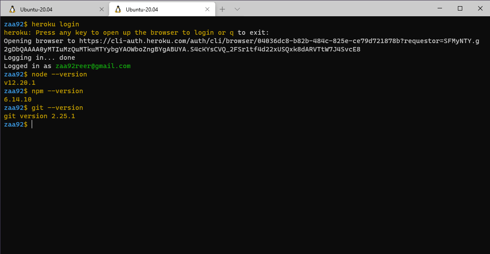

# Heroku
Heroku is a Platform as a Service (PaaS), delivering tools that enable software development. Heroku, as a PaaS, allows business to quickly deploy, build, manage, and scale enterprise-level applications while bypassing infrastructure headaches normally required to host an enterprise quality application. It acts as the middle-man between hosting/infrastructure and Salesforce.

Heroku is fully managed, giving developers the freedom to focus on their core product without the distraction of maintaining servers, hardware, or infrastructure. The Heroku experience provides services, tools, workflows, and polyglot support—all designed to enhance developer productivity.

## Installation  

## Node.js
Node.js is an open source, cross-platform runtime environment, which allows you to build server-side and networking applications. It's written in JavaScript and can be run within the Node.js runtime on any platform.

* Node.js is an open source server environment
* Node.js is free
* Node.js runs on various platforms (Windows, Linux, Unix, Mac OS X, etc.)
* Node.js uses JavaScript on the server